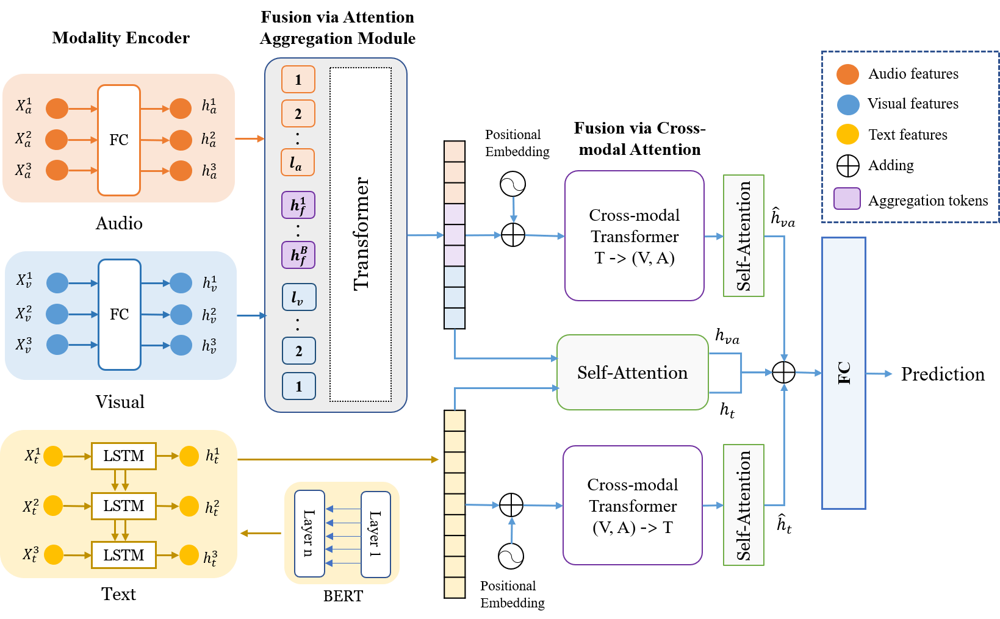

## NFNet

NHFNet: A Non-Homogeneous Fusion Network for Multimodal Sentiment Analysis

Fusion technology is the crucial for multimodal sentiment analysis. Recent attention-based fusion methods demonstrate high performance and strong robustness. However, these approaches ignore the difference in information density among the three modalities, with visual and audio having low-level signal features and conversely text having high-level semantic features. To this end, we propose a *non-homogeneous fusion network* (NHFNet) to achieve multimodal information interaction. Specifically, a fusion module with attention aggregation is designed to handle the fusion of visual and audio modalities to make them have high-level semantic features. Then, cross-modal attention is used to achieve information reinforcement of text modality and audio-visual fusion. NHFNet compensates for the differences in information density of different modalities enabling their fair interaction. To verify the effectiveness of the proposed method, we set up the aligned and unaligned experiments on the CMU-MOSEI dataset, respectively. The experimental results show that the proposed method outperforms the state-of-the-art.



## Setup
Install dependencies for CMU-MultimodalSDK
```bash
pip install h5py validators tqdm numpy argparse requests colorama
```
Install library for pretrained BERT model
```bash
pip install pytorch_pretrained_bert
```
Our dependencies
```bash
pip install sklearn
```
Download and preprocess the dataset with the following
```bash
python dataset_prep.py --datadir <path/to/CMU_MOSEI>
```
Generated folder structure (do not modify file names)
```
CMU_MOSEI/  # based on --datadir argument
    csd/  # can delete this folder to save space
        .csd files
    train/
        .npy files
    val/
        .npy files
    test/
        .npy files
```

## Evaluate
```bash
python main_msaf.py --datadir <path/to/CMU_MOSEI> --checkpoint result/mosei_aligned.pth
```

## Train
Basic training command
```bash
python main_msaf.py --datadir <path/to/CMU_MOSEI> --train
```
All parameters
```bash
usage: main_msaf.py [-h] [--datadir DATADIR] [--lr LR]
                    [--batch_size BATCH_SIZE] [--num_workers NUM_WORKERS]
                    [--epochs EPOCHS] [--checkpoint CHECKPOINT]
                    [--checkpointdir CHECKPOINTDIR] [--no_verbose]
                    [--log_interval LOG_INTERVAL] [--no_save] [--train]
```

## Reference

+ Note that some codes references [MSAF](https://github.com/anita-hu/MSAF/tree/master/cmu_mosei)